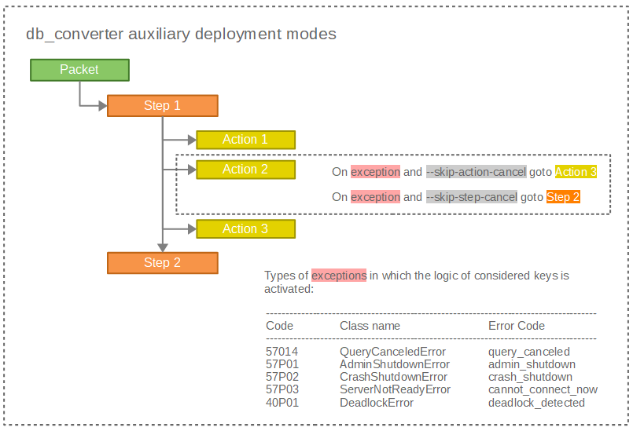

# About db_converter

<p align="left">
	<a href="https://travis-ci.com/masterlee998/db_converter">
		
	</a>
	<a href="https://coveralls.io/github/masterlee998/db_converter?branch=master">
		
	</a>
	<a href="https://github.com/masterlee998/db_converter/blob/master/LICENSE">
		
	</a>
    <a href="https://github.com/masterlee998/db_converter/releases">
        
    </a>
    <a href="https://gitter.im/db_converter/community?utm_source=badge&utm_medium=badge&utm_campaign=pr-badge">
        
    </a>
    <a href="#">
        
    </a>
</p>

`db_converter` is an open-source database migration tool for PostgreSQL 9.6+ designed for high loaded installations.

# Table of contents

<!--ts-->
   * [Introduction](#introduction)
   * [How to run](#how-to-run)
   * [Dependencies and installation](#dependencies-and-installation)
   * [Terminology](#terminology)
   * [Usage modes](#usage-modes)
   * [Documentation](#documentation)
   * [Roadmap](#roadmap)
   * [Support and contributions](#support-and-contributions)
<!--te-->

# Introduction

The basic goal of `db_converter` is to simplify the database conversion (migration) process as much as possible, while maintaining flexibility and functionality.

Tasks that can be solved using `db_converter`:

* Transactional [modification of data](https://github.com/masterlee998/db_converter/wiki/Use-cases#update-all-records-in-huge-table) of any volume
* Database [structure changing](https://github.com/masterlee998/db_converter/tree/master/packets/test_int4_to_int8) with locks control
* System and application [notifications](https://github.com/masterlee998/db_converter/wiki/Use-cases#alerts-examples) via `mattermost` (or any other messenger)
* Database maintenance ([deleting](https://github.com/masterlee998/db_converter/wiki/Use-cases#delete-old-data-from-huge-table) old data, creating new [schemas](https://github.com/masterlee998/db_converter/blob/master/packets/dba_clone_schema/01_step.sql), etc.)
* [Export](https://github.com/masterlee998/db_converter/tree/master/packets/test_export_data) data in `csv` format into encrypted archive

The key features are:

* Parallel processing of several databases
* Handling of the locks to avoid impact on the regular workload

# How to run

```bash
# run read-only packet
python38 db_converter.py \
	--packet-name=dba_get_conf \
	--db-name=dbc

	# Info: =====> DBC 1.0 started
	# Info: =====> Hold lock for packet dba_get_conf in DB dbc
	# Info: Thread 'lock_observer_dbc' runned! Observed pids: []
	# Info: --------> Packet 'dba_get_conf' started for 'dbc' database!
	# Info: lock_observer_dbc: iteration done. Sleep on 5 seconds...
	# Info: Thread 'lock_observer_dbc': Observed pids: []
	# Info: Thread 'ro_manager_db_dbc', DB 'dbc', PID 24160, Packet 'dba_get_conf', ...
	# Info:
	# ---------------------------------------------------------------------------
	# | name                         | value   | pretty_value | boot_val | unit |
	# ---------------------------------------------------------------------------
	# | autovacuum_max_workers       | 3       |              | 3        | None |
	# | autovacuum_naptime           | 60      |              | 60       | s    |
	# ....
	# Info: <-------- Packet 'dba_get_conf' finished for 'dbc' database!
	# Info: Thread lock_observer_dbc finished!
	# Info: <===== DBC 1.0 finished


# run in background
nohup python38 db_converter.py \
	--packet-name=my_packet \
	--db-name=db01
    > /dev/null 2>&1 &

tail -f log/dbc_db01_my_packet.log

# run all tests
python38 tests/test_packets.py -v
# run specific test
python38 tests/test_packets.py -v TestDBCLock
```

# Dependencies and installation

Python 3.x with modules: `sqlparse`, `requests`, `pyzipper`

```bash
yum install -y python38
# if pip is not installed
curl https://bootstrap.pypa.io/get-pip.py -o get-pip.py
python3.8 get-pip.py
pip3.8 install sqlparse
pip3.8 install requests
pip3.8 install pyzipper
```

Built-in module [py-postgresql](https://github.com/python-postgres/fe).

# Terminology

**Packet** - is a package of changes (a directory with sql files) that apply to the specified database. Packet contains `meta_data.json` (an optional file with meta information describing the package) and several sql files in `XX_step.sql` format.

**Step** - is a sql file, the contents of which are executed in one transaction, and containing the following types of commands:

* DDL (Data Definition Language) - CREATE, DROP, ALTER, TRUNCATE, COMMENT, RENAME
* DML (Data Manipulation Language) - SELECT, INSERT, UPDATE, DELETE
* DCL (Data Control Language) - GRAND, REVOKE

**Action** - is a transaction formed on the basis of `step`. If `step` does not have a `generator`, then it creates one `action`. If `step` has a `generator`, then several transactions will be generated.

**Generator** - is a sql file associated with some `step` by index number. If there is a `generator`, `step` contains placeholders for substituting the values returned by `generator` (for more details see the "Generators and Placeholders" section).

**Conversion** (migration, deployment) - is a transformation of the database structure according to specified package of changes.

<p align="center">
  
</p>


When executing `Packet`, sql files are applied to the specified database sequentially in accordance with index.

# Usage modes

`db_convertrer` works in the following modes:

* **List** all target databases according `--db-name` mask if the `--list` key is specified

* **Perform deployment** - deploy specified `packet` to the target database `--db-name`

* **Perform force deployment** - forced deployment if the `--force` key is specified - ignore the difference between hashes of `packet` at the time of repeated execution and at the time of first launch

* **Perform sequential deployment** if the `--seq` key is specified, then parallel execution is disabled (if several databases are specified) and all databases are processed sequentially according to the specified list. Several databases can be processed in parallel, the possibility of parallelizing the conversion of one database does not make sense.

* **Check** packet status - display `packet` status if the `--status` key is specified

* **Wipe** packet deployment history if the `--wipe` key is specified. Wipe means delete from  `dbc_ *` tables. Removing information about an installed package can be used for debugging purposes.

* **Unlock** unexpectedly aborted deployment if the `--unlock` key is specified

* **Stop** all active transactions of unexpectedly aborted deployment if the `--stop` key is specified. It this mode all active connections will be terminated matching with `application_name` *(specified in the `db_converter.conf` configuration file)* + `"_"` + `--packet-name`

* **Use template packet** - copy `*.sql` files from `packets/templates/template` to `packets/packet-name` if the `--template` key is specified

Auxiliary deployment modes are also provided:

* **Skip whole step** on first error like `Deadlock`, `QueryCanceledError` if the `--skip-step-cancel` key is specified

* **Skip action errors** like `Deadlock`, `QueryCanceledError` if the `--skip-action-cancel` key is specified

<p align="center">
  
</p>

In all deployment modes two parameters are mandatory:

* `--db-name` - name of directory located in `packets`

* `--packet-name` - a name of one database or a comma-separated list of databases, or `ALL` to automatically substitute all databases listed in `db_converter.conf`

# Documentation

<!--ts-->
   * [Files layout and configuration](https://github.com/masterlee998/db_converter/wiki/Files-layout-and-configuration)
   * [Command-line parameters](https://github.com/masterlee998/db_converter/wiki/Command-line-parameters)
   * [Action tracker](https://github.com/masterlee998/db_converter/wiki/Action-tracker)
   * [meta_data.json description](https://github.com/masterlee998/db_converter/wiki/meta_data.json-description)
   * [Transactional processing of objects and data](https://github.com/masterlee998/db_converter/wiki/Transactional-processing-of-objects-and-data)
   * [Threads](https://github.com/masterlee998/db_converter/wiki/Threads)
   * [Internals](https://github.com/masterlee998/db_converter/wiki/Internals)
   * [Use cases](https://github.com/masterlee998/db_converter/wiki/Use-cases)
<!--te-->

# Roadmap

* Synchronization of packets between source and target databases
* Query bot in mattermost: running packets from browser instead of command line
* Web interface
* * scheduling periodic tasks to run
* * packets developing
* * testing
* * approving
* * delivery for production
* * viewing logs and deployment statuses

# Support and contributions

Bug reports and new features are appreciated and may be filed through the [issue tracker](https://github.com/masterlee998/db_converter/issues).

Feel free to get technical support in [Gitter](https://gitter.im/db_converter/community?utm_source=badge&utm_medium=badge&utm_campaign=pr-badge).
